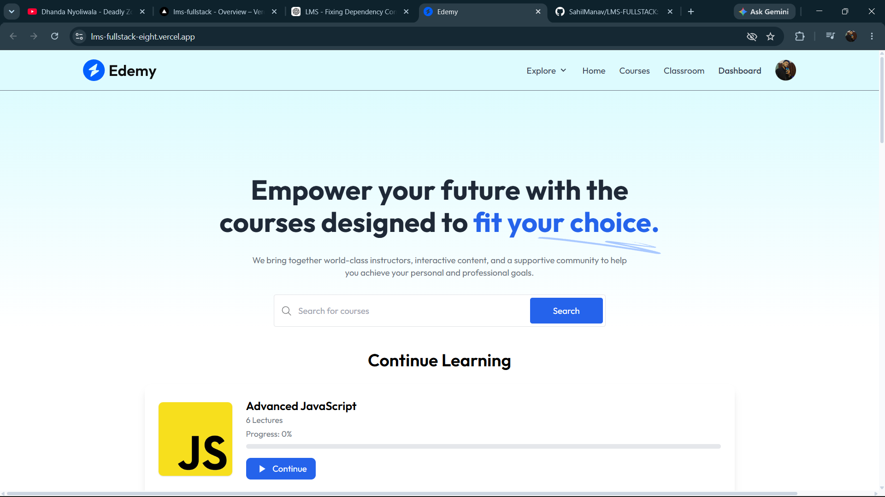

<p align="center">
  
</p>

# Edemy - Learning Management System (LMS)
A full-stack Learning Management System built using the MERN stack, Clerk Authentication, Stripe Payments, Cloudinary, and MongoDB.

## Features

- User Authentication with Clerk
- Course Browsing & Search
- Educator Dashboard
- Course Creation & Management
- Video Lectures
- Progress Tracking
- Certificates
- Classroom & Discussions
- Notes & Submissions
- Leaderboard System
- Stripe Payment Integration
- Responsive Design

## Tech Stack

### Frontend
- React.js
- Vite
- Tailwind CSS
- Clerk
- Axios

### Backend
- Node.js
- Express.js
- MongoDB
- Mongoose
- Cloudinary
- Stripe

## Live Demo

Frontend:
https://lms-fullstack-eight.vercel.app

Backend API:
https://lms-fullstack-server-ashy.vercel.app

## Installation

### Server

```bash
cd server
npm install
npm start
```

### Client

```bash
cd client
npm install
npm run dev
```

Author
Sahil Manav
